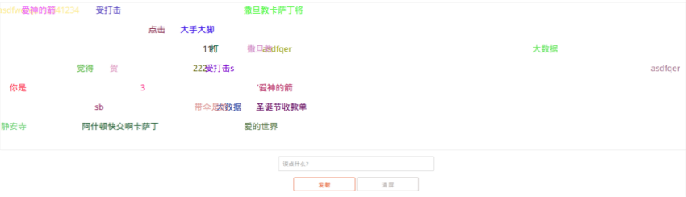

# demo-js-danmu 弹幕

demo-js-danmu 是一个基于wilddog JavaScript SDK实现的弹幕。

## 本地运行

可以直接用浏览器访问app/index.html。

## 更多示例

这里分类汇总了 WildDog平台上的示例程序和开源应用，　链接地址：[https://github.com/WildDogTeam/wilddog-demos](https://github.com/WildDogTeam/wilddog-demos)

## 相关文档

* [Wilddog 概览](https://z.wilddog.com/overview/guide)
* [JavaScript SDK快速入门](https://z.wilddog.com/web/quickstart)
* [JavaScript SDK 开发向导](https://z.wilddog.com/web/guide/1)
* [JavaScript SDK API](https://z.wilddog.com/web/api)
* [下载页面](https://www.wilddog.com/download/)
* [Wilddog FAQ](https://z.wilddog.com/faq/qa)

## License
MIT
http://wilddog.mit-license.org/

